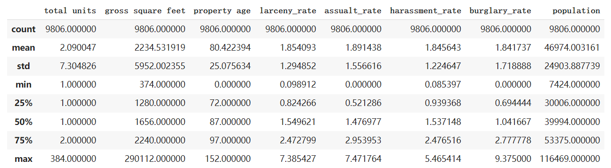
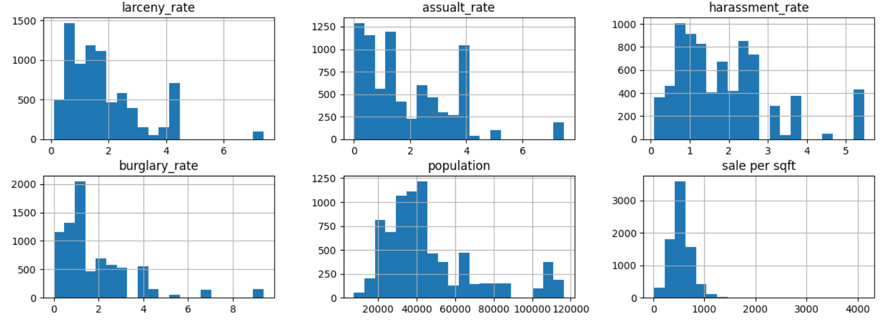
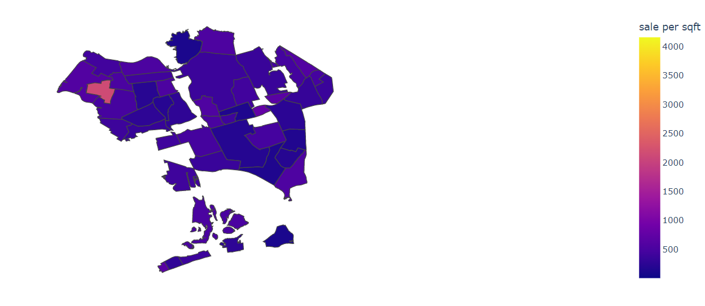
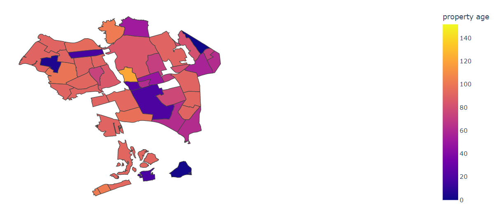
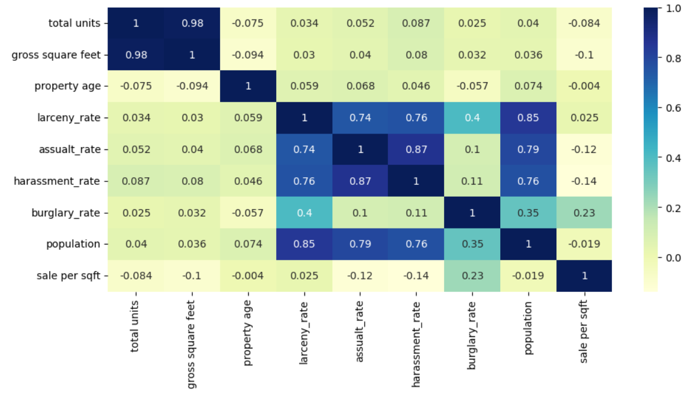
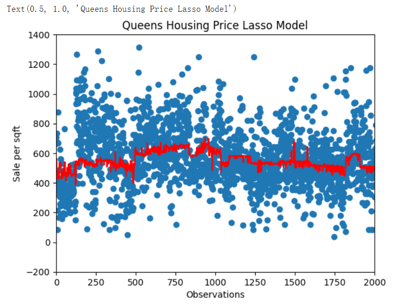
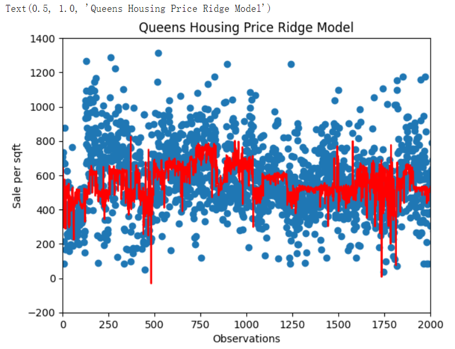

  

### Introduction

This project investigates the relationship between the occurrence of crime and the housing price in different areas of Queens. Generally, a safe neighborhood with lower crime rate would have higher property value. The dataset includes larceny, burgalry, assulault and sexual harrassment crime rate for each zipcode in Queens. We will explore which kind of crime has a greater effect on the sale price of a house. We will also use neighborhood information to make choropleth graphs to illustrate the sale price in Queens county as a whole.

H1: Burglary crimes reduce a house’s price more severely than do larceny crimes.
H2: Bigger houses will sell at a higher price per square foot.

---

### Data Collection

I use data originally collected from NYC Department of Finance on property sales in Queens County from January to December 2022. Also, I use NYC OpenData for valid felony, misdemeanor, and violation crimes reported to the New York City Police in December 2022. Further, I added population data for zipcodes in Queens from New York Demographics. After cleaning the data files, I calculate the crime rates for each zipcode in Queens and add them to the home sale file.
To investigate how different type of crimes affect housing price, the linear regressioin model appears below:

sale per sqft = β0 + β1*total units + β2*gross square feet + β3*property age + β4*larceny_rate + β5*assualt_rate + β6*harassment_rate + β7*burglary_rate + β8*population

- total units: The total number of units at the listed property.
- gross square feet: The total area of all the floors of a building, including the land area
- property age: age of the property sold
- larceny_rate: number of larceny complaints in a zipcode area divided by total complaints in Queens
- assualt_rate: number of assualt complaints in a zipcode area divided by total complaints in Queens
- harassment_rate: number of harassment complaints in a zipcode area divided by total complaints in Queens
- burglary_rate: number of burglary complaints in a zipcode area divided by total complaints in Queens
- population: population in a zipcode area

  

> Descriptive Statistics

  

> Histograms for crime rates

---

### Choropleth Graphs

I used plotly to make choropleth graphs on the housing data. The neighborhood information is used to match the ids in Queens geojson file. The first graph shows the sale price per square foot in Queens County. In general, most property was sold between 500 and 1000 per square foot. The second graph shows the age of the properties at the time of sales. Well, it seems that a lot of properties sold are between 80 and 120 years old. In the middle of the map, the properties sold are relatively new.

  

> Sale price in Queens

  

> Age of Property Sold

---

### Correlation Heatmap

I use seaborn to draw a heatmap for the correlation among home sale variables. The blue color means they are highly correlated. The lighter the color means they are not correlated with one another. It appears that sale price per square foot does not have a strong correlation with any other variables. Burglary crime has the greatest positive coefficient on sale price. Assualt and harrassment both have negative coefficent. It can be argued that wealthy suburbs attract more burglary. High burglary rate indicates that the area is wealthy. Larceny, assualt and harrassment are highly correlated with one another.

  

> Correlation Table

---

### Ridge and Lasso Model

I apply polynomial features to my linear regression. Linear regression might not capture all the variance in the explanary variables. Then I use ridge regularization and lasso regularization to reduce variance in my models. Overall, my model does not predict the sale per square foot well. The coefficient of determination r-squared is as low as 0.18. With ridge regularization, the r-squared did improve a little and the ridge model is a better model to use for predication in my case. The red line in ridge model is more spread out and captures more variance than that in the lasso model.

 

> Lasso Model & Ridge Model

---

### Conclusion

Housing price can be as unpredictable as stock price. In my study, gross square feet has a negative coefficient. Properties with larger gross square feet do not sell at a higher price per square foot. Instead, the larger the property area, the less the price per square foot. Perhaps buyers tend to bargain when the total sell price is high. Besides, buyers would get Covid discount due to the pandemic. Furthermore, burglary crime does not reduce the sale price per square foot. Instead, it increases the property price as the coefficient on burglary crime is positive. Over the past few years, we experienced civil unrest and rise of hate crimes. The extend to which crimes affect property values becomes unfathomable. Even though the occurance of burglary crime is high, the house price is not negatively impacted. Different crimes have different natures. Other crimes do have small negative effects on the property price.

My model does not predict housing price per square foot well. The r-squared shows that the model only explain roughly 19% of the variance in the houseing price. Everything has changed since the beginning of the pandemic. Housing market in Queens has become a buyers market. Generally, the property price is lower than it was before the pandemic and the homes stay on the market longer. None of my explanary variables has a strong correlation with the housing price. The property value is not dependent on the property age, population or gross square feet. In short, it is a good time to buy a house at a discount in Queens. If a place has a relatively high burglary rate, that area has some nice house.

---

### Postmortem

Due to data availability, some variables are not included in my model such as house insurance cost and property tax. I had to search high and low for anything relevant to my prediction model but I had no much luck. Cleaning the crime data takes a lot of time. I first converted the latitudes and longitudes into addresses. The zipcode was used to keep track the number of each crime occurances. Then I joined the crime data file with the home data file based on the zipcode. Creating the choropleth graph was a challege. I needed to create a dictionary that include key value pairs for the neighborhoods in Queens. If the neighborhood is found in geojson file, an id number is assigned to that observation. That id number is used to color the choropleth map. The polynomial features would turn the x variables into too many columns with degree 3 or more. Since my clean data file has over 8000 rows, keeping the polynomial features degree at 2 would be best for running the Rigde and Lasso models.
